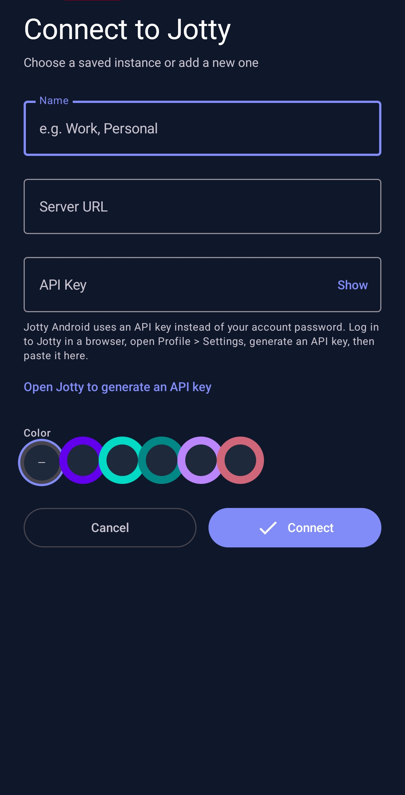
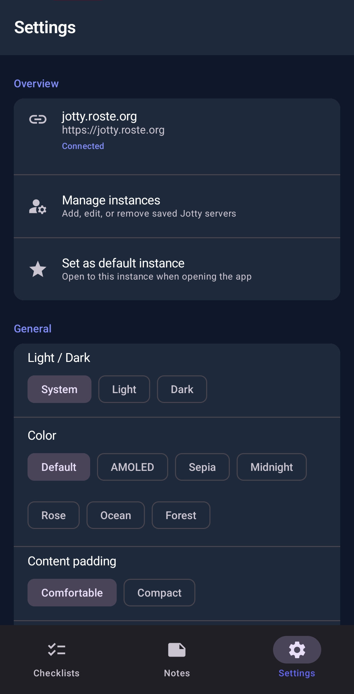
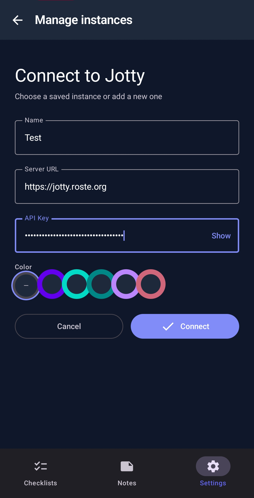
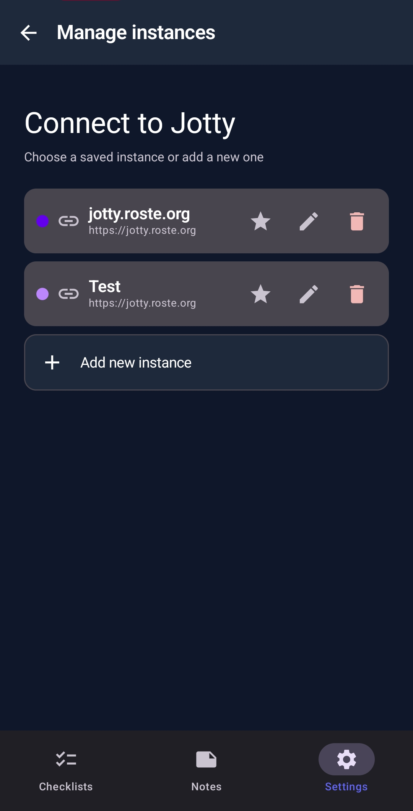
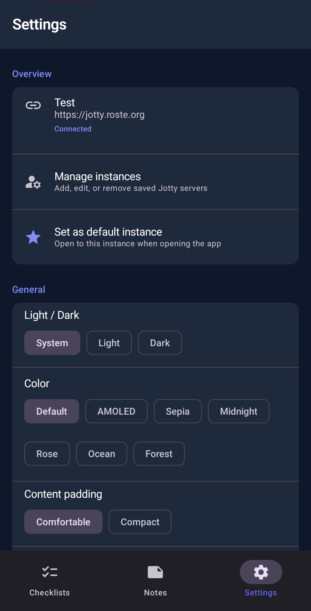
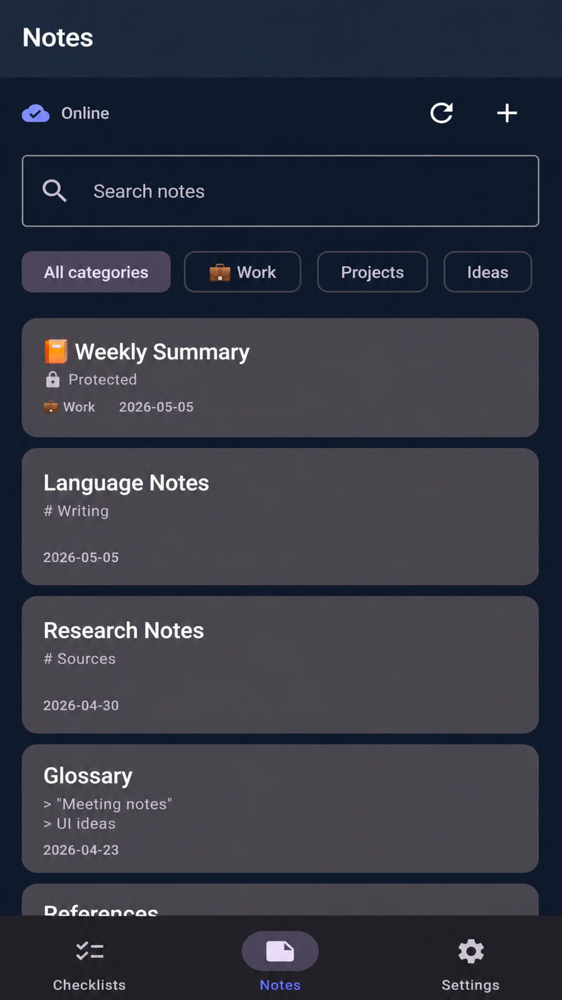
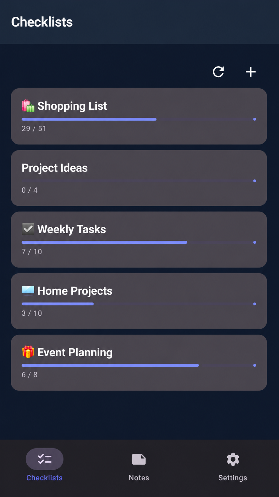

# Jotty Android

[](https://github.com/Darknetzz/jotty-android/releases/latest)
[](https://github.com/Darknetzz/jotty-android/releases/tag/dev-latest)
[](https://github.com/Darknetzz/jotty-android/actions/workflows/ci.yml)
[](https://github.com/Darknetzz/jotty-android/actions/workflows/release-apk.yml)
[](https://github.com/Darknetzz/jotty-android/actions/workflows/dev-latest.yml)

An unofficial Android client for [Jotty](https://jotty.page/) — the self-hosted, file-based checklist and notes app.

> This is an independent community project and is not an official Jotty app, and is not affiliated with or endorsed by the Jotty project.

**Disclaimer:** This project is built mostly for personal use. Much of the code was written with AI assistance and may contain bugs or rough edges. If you find issues or want to improve things, issues and contributions are welcome. The web version of Jotty is very much mobile friendly and is probably sufficient for most people.

## Features

- **Checklists** — Create, view, and manage checklists. Add items, check/uncheck tasks, and track progress.
- **Notes** — Create and edit notes with Markdown support. View and save your content.
- **Offline support** — Work on notes and checklists without an internet connection. Changes sync automatically when you're back online.
- **Connect to your server** — Works with any self-hosted Jotty instance. Configure server URL and API key once.

## Screenshots

|  |  |
|---|---|
| <br />Connect to Jotty by entering instance details and selecting an accent color. | <br />Adjust app preferences like theme mode, color palette, and layout density. |
| <br />Add or edit a server instance by entering name, URL, API key, and color. | <br />Manage saved instances, choose default, edit details, or remove entries. |
| <br />Review connected instance details and set defaults and appearance options. | <br />Browse notes with search and category filters, including protected notes. |
| <br />Track checklist progress at a glance with per-list completion bars and counts. |  |

## Releases / Download

Pre-built APKs are published on the [Releases](https://github.com/Darknetzz/jotty-android/releases) page.

- **With release signing configured** (recommended for this repo): CI attaches **`jotty-android-{version}.apk`** — minified and signed with the maintainer’s release keystore so updates install over the previous release without uninstalling.
- **Without signing secrets** (e.g. forks): CI attaches **`jotty-android-{version}-debug.apk`** only (debug-signed).

Maintainers: create one release keystore and add GitHub Actions secrets — see **`keystore.properties.example`** (fixes [#9](https://github.com/Darknetzz/jotty-android/issues/9)).

- **Stable release builds:** download **`jotty-android-*.apk`** from the release you want (or `*-debug.apk` if that is the only asset).
- **Rolling dev build:** use the [Dev Latest pre-release](https://github.com/Darknetzz/jotty-android/releases/tag/dev-latest), which is updated automatically on every push to `dev`.

Install on your device by enabling "Install from unknown sources" if needed.

## Setup

### 1. Get your API key

1. Log into your Jotty instance in a browser.
2. Go to **Profile** → **Settings**.
3. In the **API Key** section, click **Generate**.
4. Copy the generated key (starts with `ck_`).

### 2. Configure the app

1. Open the app.
2. Enter your Jotty server URL (e.g. `https://jotty.example.com`).
3. Enter your API key.
4. Tap **Connect**.

## Releasing

Version is defined in **`gradle.properties`** (single source of truth):

- `VERSION_NAME` — user-visible version (e.g. `1.0.1`)
- `VERSION_CODE` — integer, must increase each release (e.g. `2`)

Preferred flow (automated):

- **Windows (PowerShell):** `.\release.ps1`
- **Linux/macOS (bash):** `./release.sh`

Both scripts can prompt for a version (default is current patch + 1), increment `VERSION_CODE`, and promote `CHANGELOG.md` from `Unreleased` to a dated release entry.

Manual fallback: update both values in `gradle.properties`, add an entry to **`CHANGELOG.md`**, then build and tag (e.g. `v1.0.1`).

**Signed release APK:** Copy `keystore.properties.example` to `keystore.properties`, create a keystore (see the example file for the `keytool` command), then run `.\build.ps1 -Release`. The release APK will be signed and installable. Keep your keystore and passwords safe and never commit them.

## Building

### Requirements

- Android Studio Hedgehog (2023.1.1) or newer, or
- JDK 17+
- Android SDK 36

### Gradle Wrapper

**Recommended:** Open the project in Android Studio. It will download the Gradle wrapper automatically when you sync.

If the wrapper is missing (e.g. `gradle-wrapper.jar`), create it:

```bash
# With Gradle installed:
gradle wrapper --gradle-version 9.1.0
```

### Build commands

```bash
# Debug APK
./gradlew assembleDebug

# Release APK (signed)
./gradlew assembleRelease
```

## Troubleshooting

### “App not installed” when updating

Android only allows an update when the new APK is signed with the **same certificate** as the installed app. This happens if you switch between a **debug** build, a **locally built** APK, and a **GitHub release** APK, or if releases were signed with different keys.

- **Fix for users:** Uninstall the old app once, then install the APK from the latest [Release](https://github.com/Darknetzz/jotty-android/releases). Data on the device is removed with uninstall; Jotty server data is unchanged.
- **Fix for maintainers:** Use one release keystore for every GitHub release (secrets in `keystore.properties.example`). Do not change the keystore between releases.

### Server log: `Session check error` / `ERR_SSL_WRONG_VERSION_NUMBER`

This usually means something is speaking **HTTP** where **TLS (HTTPS)** is expected:

- **If the app talks to your server:** In the app, use an instance URL that starts with `https://` (e.g. `https://jotty.example.com`). If you enter a URL without a scheme, the app adds `https://` by default.
- **If the server does a “session check”** (e.g. an outbound request to validate the session): that request’s URL must use `https://`. Check the Jotty server config (e.g. app URL, callback URL, or any URL used for session validation) and ensure it’s HTTPS, not HTTP.

### Server log: `XChaCha Decryption Error: Error: invalid input` at `from_hex`

The server is decoding encrypted content with **hex** while the Android app (and typically the Jotty web app) store **base64** in the encrypted JSON (`salt`, `nonce`, `data`). So the server is likely using the wrong decoder for that payload.

- **Fix on the Jotty server:** In the Jotty repo, search for XChaCha decryption and `from_hex`. The code that reads the encrypted note body should decode the JSON fields (salt, nonce, data) as **base64**, not hex. If some path expects hex, either switch it to base64 or add a format check (e.g. try base64 first, then hex) so both formats are accepted.

## Architecture

- **Jetpack Compose** — UI
- **Retrofit** — REST API client for Jotty
- **Room** — Local database for offline storage
- **DataStore** — Storing app settings and instance metadata
- **EncryptedSharedPreferences** — Secure API key storage (with DataStore fallback when unavailable)
- **Navigation Compose** — Screen navigation

## Offline Support

Jotty Android supports working offline. When enabled (default), notes are stored locally and automatically synced when you have an internet connection. See [OFFLINE_NOTES.md](OFFLINE_NOTES.md) for details.

Key features:
- Create, edit, and delete notes without internet
- Automatic sync when connectivity is restored
- Visual sync status indicators
- Last-write-wins conflict resolution

## Encryption

Jotty supports **XChaCha20-Poly1305** (passphrase-only, recommended) and **PGP**. This app supports only **XChaCha20-Poly1305** in-app: you can encrypt and decrypt notes with a passphrase. Notes encrypted with **PGP** in the Jotty web app must be decrypted there; the app will show a short message and a link to use the web app.

**Limitations:** Encrypted note content cannot be searched (titles and metadata remain searchable). Only the key owner can decrypt; shared encrypted notes stay encrypted for others. There is no passphrase recovery — keep secure backups of your passphrase.

## API Reference

The app uses the [Jotty REST API](https://github.com/fccview/jotty/blob/main/howto/API.md). Authentication is via the `x-api-key` header.

## Contributing

Contributions are welcome.

- **Issues** — Use [GitHub Issues](https://github.com/Darknetzz/jotty-android/issues) to report bugs, suggest features, or ask questions. A short description of what you expected, what happened, and your environment (Android version, Jotty server URL shape if relevant) helps a lot.
- **Pull requests** — Feel free to open a PR for fixes or improvements. Match the existing Kotlin and Compose style; see [`AGENTS.md`](AGENTS.md) for project layout and conventions aimed at contributors and tooling.

## License

MIT
