# Jotty Android

[](https://github.com/Darknetzz/jotty-android/releases/latest)
[](https://github.com/Darknetzz/jotty-android/releases/tag/dev-latest)

An unofficial Android client for [Jotty](https://jotty.page/) — the self-hosted, file-based checklist and notes app.

> This is an independent community project and is not an official Jotty app, and is not affiliated with or endorsed by the Jotty project.

**Disclaimer:** This project is built mostly for personal use. Much of the code was written with AI assistance and may contain bugs or rough edges. If you find issues or want to improve things, issues and contributions are welcome. The web version of Jotty is very much mobile friendly and is probably sufficient for most people.

## Features

- **Checklists** — Task lists with progress, inline edit, and reorder (buttons or optional drag). **Project / Kanban** boards support column status management and task moves.
- **Notes** — Markdown notes with search, category filters, GFM tables, and server-hosted images. Editor toolbar and smart list continuation on Enter.
- **Offline** — Notes and checklists work without a connection; changes sync on reconnect, with optional background sync and per-item pending indicators.
- **Multi-instance** — Save several Jotty servers, set a default, and assign an accent color per instance.
- **Encryption** — XChaCha20-Poly1305 encrypt and decrypt in-app; optional biometric unlock for remembered passphrases (PGP-encrypted notes require the [Jotty web app](https://jotty.page/)).
- **Appearance** — System/light/dark theme, color palettes, custom accent hex, reader text size, and content padding.
- **Settings & dashboard** — Health check, behavior toggles, server summary overview, security controls, and exportable debug logs.
- **Deep links** — `jotty-android://open/note/{id}` opens a note directly in the app.
- **Connect** — Works with any self-hosted Jotty instance via server URL and API key.

## Screenshots

Demo content from v1.5.0. **Dark** is left, **light** is right. All captures in [`images/`](images/) (`readme-*.png`).

<table>
  <thead>
    <tr>
      <th align="center" width="50%">Dark</th>
      <th align="center" width="50%">Light</th>
    </tr>
  </thead>
  <tbody>
    <tr>
      <td align="center">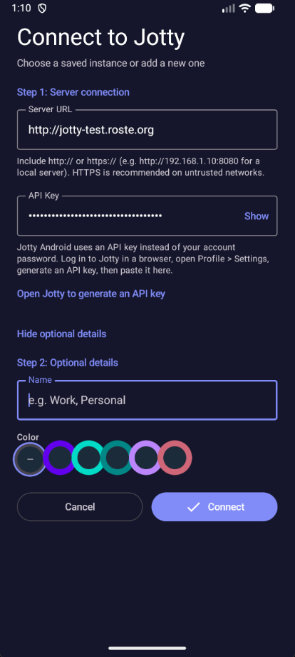</td>
      <td align="center">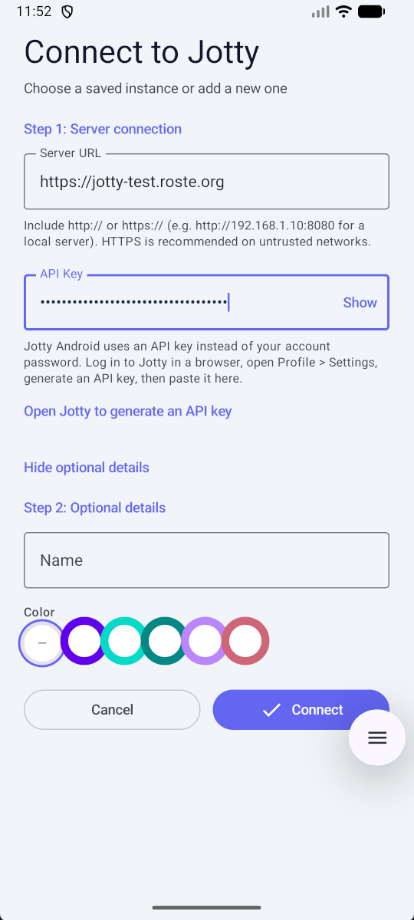</td>
    </tr>
    <tr>
      <td colspan="2" align="center"><sub><b>Connect</b> — server URL, API key, and accent color</sub></td>
    </tr>
    <tr>
      <td align="center">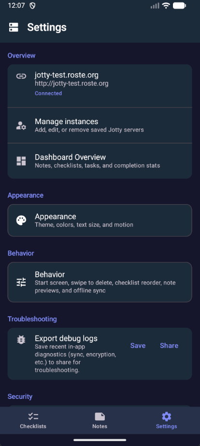</td>
      <td align="center">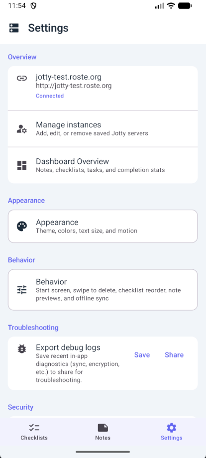</td>
    </tr>
    <tr>
      <td colspan="2" align="center"><sub><b>Settings</b> — instance, appearance, behavior, troubleshooting</sub></td>
    </tr>
    <tr>
      <td align="center">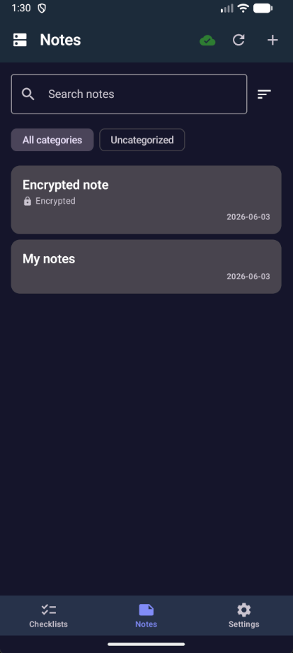</td>
      <td align="center">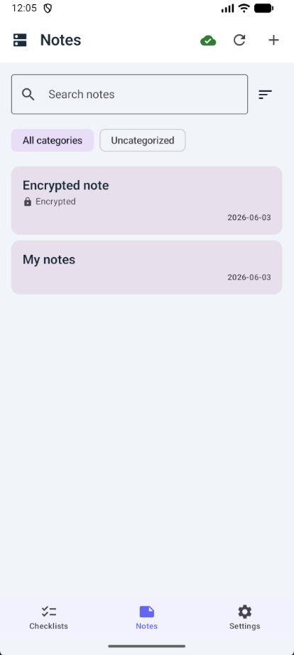</td>
    </tr>
    <tr>
      <td colspan="2" align="center"><sub><b>Notes list</b> — search and encrypted note badge</sub></td>
    </tr>
    <tr>
      <td align="center">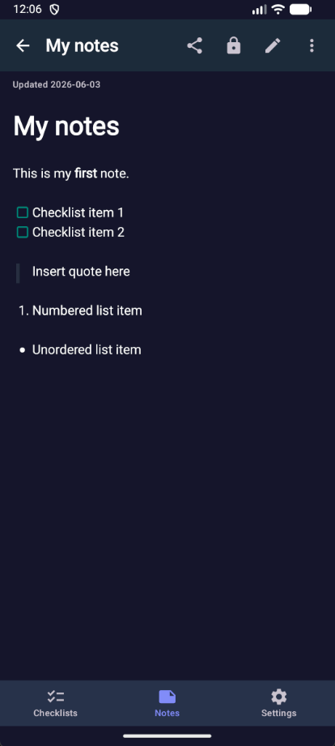</td>
      <td align="center">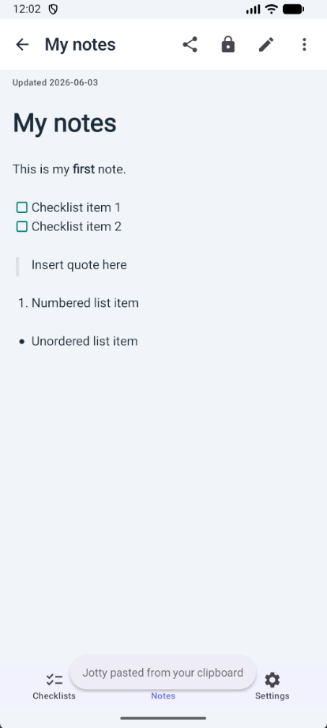</td>
    </tr>
    <tr>
      <td colspan="2" align="center"><sub><b>Note detail</b> — Markdown, lists, quotes, checkboxes</sub></td>
    </tr>
    <tr>
      <td align="center">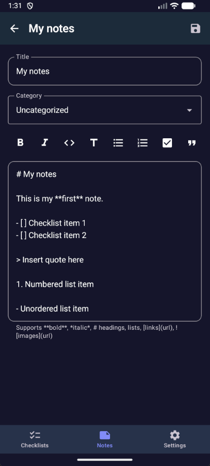</td>
      <td align="center">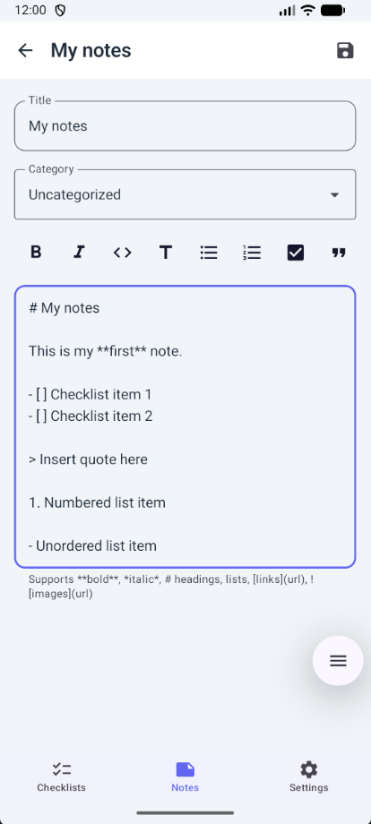</td>
    </tr>
    <tr>
      <td colspan="2" align="center"><sub><b>Note editor</b> — formatting toolbar</sub></td>
    </tr>
    <tr>
      <td align="center">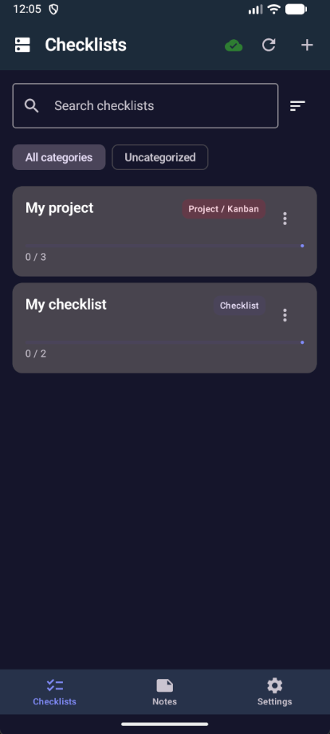</td>
      <td align="center">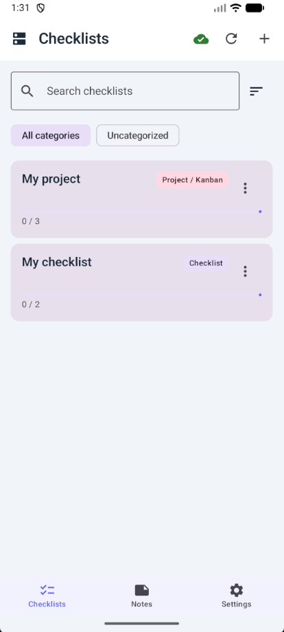</td>
    </tr>
    <tr>
      <td colspan="2" align="center"><sub><b>Checklists</b> — lists and Kanban projects with progress</sub></td>
    </tr>
    <tr>
      <td align="center">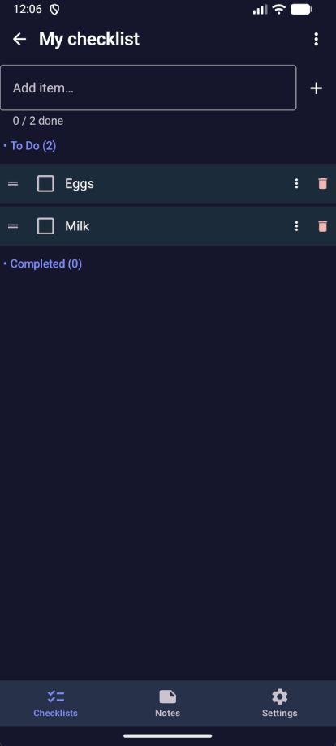</td>
      <td align="center">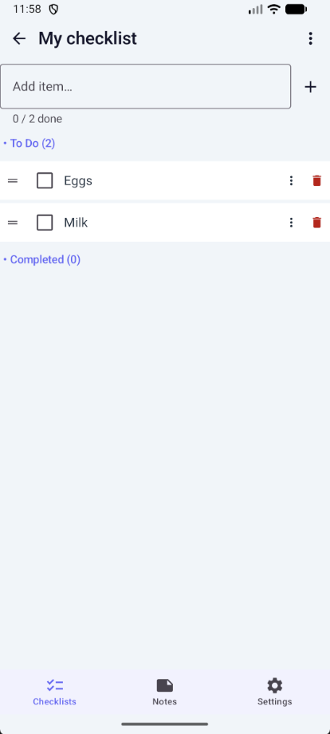</td>
    </tr>
    <tr>
      <td colspan="2" align="center"><sub><b>Checklist detail</b> — items, reorder, progress</sub></td>
    </tr>
    <tr>
      <td align="center">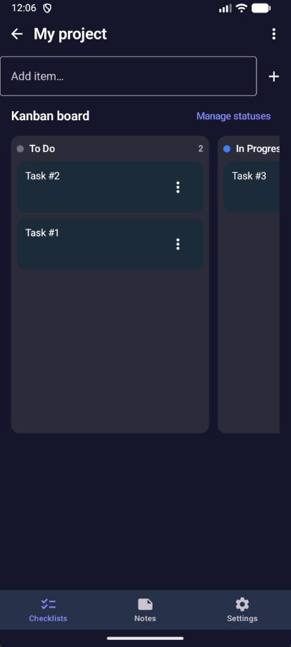</td>
      <td align="center">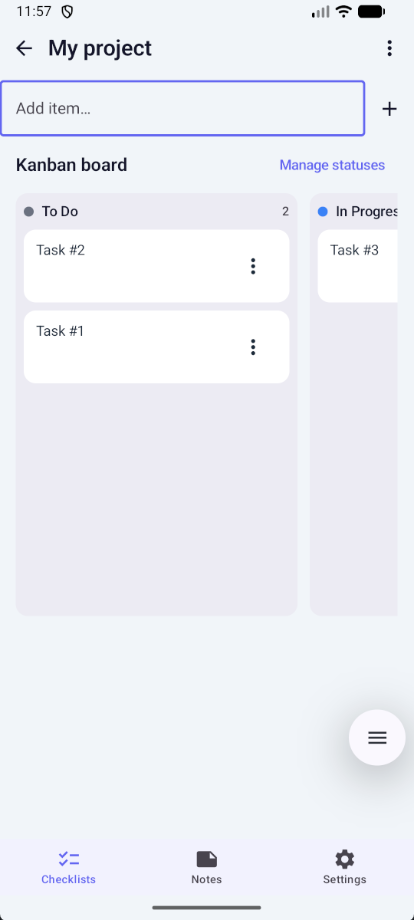</td>
    </tr>
    <tr>
      <td colspan="2" align="center"><sub><b>Kanban</b> — columns, tasks, manage statuses</sub></td>
    </tr>
    <tr>
      <td align="center">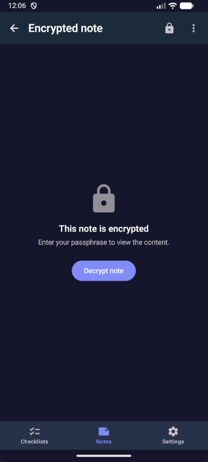</td>
      <td align="center">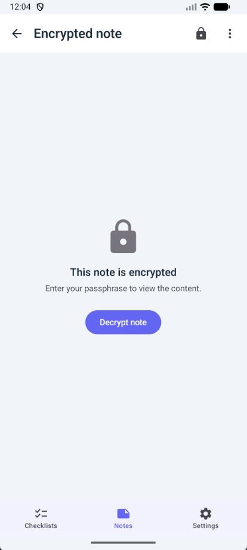</td>
    </tr>
    <tr>
      <td colspan="2" align="center"><sub><b>Encrypted note</b> — locked until you decrypt</sub></td>
    </tr>
    <tr>
      <td align="center">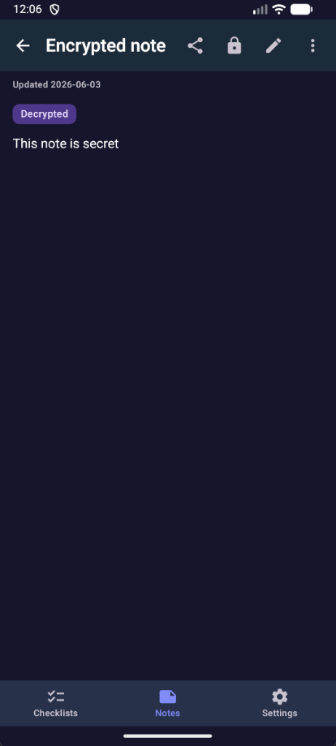</td>
      <td align="center">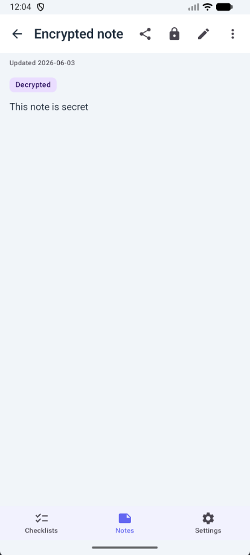</td>
    </tr>
    <tr>
      <td colspan="2" align="center"><sub><b>Encrypted note</b> — decrypted with session badge</sub></td>
    </tr>
    <tr>
      <td align="center">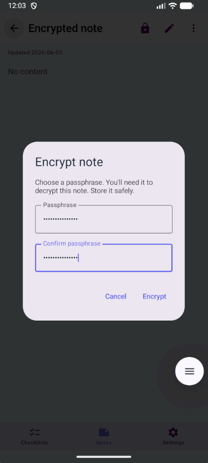</td>
      <td align="center">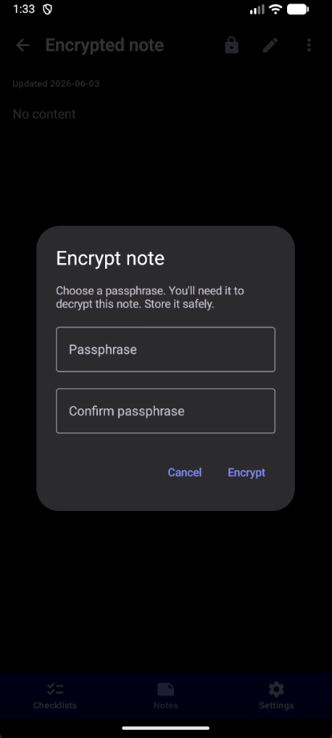</td>
    </tr>
    <tr>
      <td colspan="2" align="center"><sub><b>Encrypt</b> — passphrase dialog</sub></td>
    </tr>
    <tr>
      <td align="center">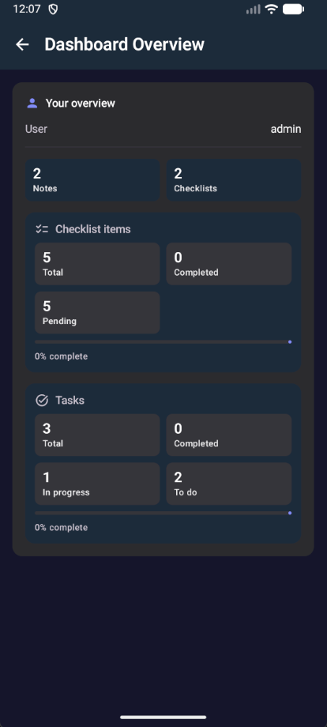</td>
      <td align="center">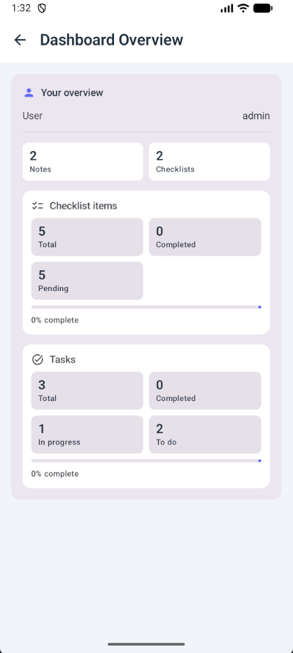</td>
    </tr>
    <tr>
      <td colspan="2" align="center"><sub><b>Dashboard</b> — server stats overview</sub></td>
    </tr>
  </tbody>
</table>

## Releases / Download

Pre-built APKs are published on the [Releases](https://github.com/Darknetzz/jotty-android/releases) page.

- **With release signing configured** (recommended): locally built or published APKs use **`jotty-android-{version}.apk`** from [Releases](https://github.com/Darknetzz/jotty-android/releases) when you run `scripts/publish-dev-latest` or `publish-release.ps1 -LocalBuild` with `keystore.properties`.
- **Without signing** (e.g. forks): builds produce **`jotty-android-{version}-debug.apk`** only (debug-signed).

Maintainers: create one release keystore — see **`keystore.properties.example`**. CI and APK builds run **locally** by default ([docs/LOCAL_CI.md](docs/LOCAL_CI.md)); GitHub Actions workflows are manual-only to avoid runner costs.

- **Stable release builds:** download **`jotty-android-*.apk`** from the release you want (or `*-debug.apk` if that is the only asset).
- **Rolling dev build:** use the [Dev Latest pre-release](https://github.com/Darknetzz/jotty-android/releases/tag/dev-latest). After `setup-repo-git`, each push to `dev` auto-publishes locally (no GitHub Actions); see [docs/LOCAL_CI.md](docs/LOCAL_CI.md).

Install on your device by enabling "Install from unknown sources" if needed.

## Setup

### 1. Get your API key

1. Log into your Jotty instance in a browser.
2. Go to **Profile** → **Settings**.
3. In the **API Key** section, click **Generate**.
4. Copy the generated key (starts with `ck_`).

### 2. Configure the app

1. Open the app.
2. Enter your Jotty server URL (e.g. `https://jotty.example.com`).
3. Enter your API key.
4. Tap **Connect**.

## Releasing

Version is defined in **`gradle.properties`** (single source of truth):

- `VERSION_NAME` — user-visible version (e.g. `1.0.1`)
- `VERSION_CODE` — integer, must increase each release (e.g. `2`)

Release scripts (two steps):

| Step | Windows | Linux/macOS |
|------|---------|-------------|
| **1. Prep** (version + changelog) | `.\release.ps1` | `./release.sh` |
| **2. Publish** (push, PR, merge, GitHub release + APK) | `.\scripts\publish-release.ps1 -LocalBuild` | `./scripts/publish-release.sh --local-build` |

**Prep** prompts for a version (default: current patch + 1), increments `VERSION_CODE`, and promotes the top `CHANGELOG.md` `[dev-latest]` section to a dated stable entry, leaving a fresh `[dev-latest]` header for the rolling [dev-latest](https://github.com/Darknetzz/jotty-android/releases/tag/dev-latest) pre-release.

**Publish** requires a clean `dev` branch, `gh` CLI logged in, and committed prep. It pushes `dev`, opens (or reuses) **`dev` → `main`**, merges the PR, creates **`gh release create vX.Y.Z`** on `main`, and with **`-LocalBuild`** builds and uploads the APK locally (no GitHub Actions).

**Typical stable release flow**

1. `.\release.ps1` (or `./release.sh`), then commit `gradle.properties` + `CHANGELOG.md` on **`dev`**.
2. `.\scripts\ci-local.ps1` — optional but recommended before publish.
3. `.\scripts\publish-release.ps1 -LocalBuild` (or `./scripts/publish-release.sh --local-build`).
4. **`dev` is synced to `main`** via `.\scripts\sync-dev-with-main.ps1` (included when using `-LocalBuild`).

**Dev builds:** run `.\scripts\setup-repo-git.ps1` once per clone, then `git push origin dev` (or `.\scripts\push-dev.ps1`) — a pre-push hook publishes [dev-latest](https://github.com/Darknetzz/jotty-android/releases/tag/dev-latest) in the background. Manual fallback: `.\scripts\publish-dev-latest.ps1`.

See [docs/LOCAL_CI.md](docs/LOCAL_CI.md) for all local workflow commands. GitHub Actions in `.github/workflows/` are **manual-only** (`workflow_dispatch`); disable Actions entirely in repo settings if you prefer.

Manual fallback: update both values in `gradle.properties`, add an entry to **`CHANGELOG.md`**, then build and tag (e.g. `v1.0.1`).

### Git: `dev-latest` tag conflicts on pull

The rolling **`dev-latest`** tag moves on every push to `dev`. Without setup, `git pull --tags` may report `would clobber existing tag` for `dev-latest` (the branch still updates; only the tag is skipped).

**One-time per clone** (fixes `git pull --tags` permanently for this repo):

```powershell
.\scripts\setup-repo-git.ps1
```

```bash
./scripts/setup-repo-git.sh
```

That adds a `+refs/tags/dev-latest` fetch refspec so Git force-updates the local tag instead of refusing.

**Day to day:**

```powershell
.\scripts\pull-dev.ps1
```

```bash
./scripts/pull-dev.sh
```

Or, after setup: `git pull --tags origin dev`. To refresh only the tag: `.\scripts\sync-dev-latest-tag.ps1` / `./scripts/sync-dev-latest-tag.sh`.

**Signed release APK:** Copy `keystore.properties.example` to `keystore.properties`, create a keystore (see the example file for the `keytool` command), then run `.\build.ps1 -Release`. The release APK will be signed and installable. Keep your keystore and passwords safe and never commit them.

## Building

### Requirements

- Android Studio Ladybug (2024.2.1) or newer, or
- JDK 17+
- Android SDK 36
- Min SDK 26 (Android 8.0)

### Gradle Wrapper

**Recommended:** Open the project in Android Studio. It will download the Gradle wrapper automatically when you sync.

If the wrapper is missing (e.g. `gradle-wrapper.jar`), create it:

```bash
# With Gradle installed:
gradle wrapper --gradle-version 9.5.1
```

### Build commands

```bash
# Debug APK
./gradlew assembleDebug

# Release APK (signed)
./gradlew assembleRelease
```

## Troubleshooting

### “App not installed” when updating

Android only allows an update when the new APK is signed with the **same certificate** as the installed app. This happens if you switch between a **debug** build, a **locally built** APK, and a **GitHub release** APK, or if releases were signed with different keys.

- **Fix for users:** Uninstall the old app once, then install the APK from the latest [Release](https://github.com/Darknetzz/jotty-android/releases). Uninstall clears **app data on the device** (saved server instances, API keys, offline cache)—you will need to add your instance again. Content on your **Jotty server** is not deleted.
- **Fix for maintainers:** Use one release keystore for every GitHub release (secrets in `keystore.properties.example`). Do not change the keystore between releases.

### Server log: `Session check error` / `ERR_SSL_WRONG_VERSION_NUMBER`

This usually means something is speaking **HTTP** where **TLS (HTTPS)** is expected:

- **If the app talks to your server:** In the app, use an instance URL that starts with `https://` (e.g. `https://jotty.example.com`). If you enter a URL without a scheme, the app adds `https://` by default.
- **If the server does a “session check”** (e.g. an outbound request to validate the session): that request’s URL must use `https://`. Check the Jotty server config (e.g. app URL, callback URL, or any URL used for session validation) and ensure it’s HTTPS, not HTTP.

### Server log: `XChaCha Decryption Error: Error: invalid input` at `from_hex`

The server is decoding encrypted content with **hex** while the Android app (and typically the Jotty web app) store **base64** in the encrypted JSON (`salt`, `nonce`, `data`). So the server is likely using the wrong decoder for that payload.

- **Fix on the Jotty server:** In the Jotty repo, search for XChaCha decryption and `from_hex`. The code that reads the encrypted note body should decode the JSON fields (salt, nonce, data) as **base64**, not hex. If some path expects hex, either switch it to base64 or add a format check (e.g. try base64 first, then hex) so both formats are accepted.

## Architecture

- **Jetpack Compose** — UI
- **Retrofit** — REST API client for Jotty
- **Room** — Local database for offline storage
- **DataStore** — Storing app settings and instance metadata
- **EncryptedSharedPreferences** — Secure API key storage (with DataStore fallback when unavailable)
- **Navigation Compose** — Screen navigation

## Offline Support

Jotty Android supports working offline. When enabled (default), **notes and checklists** are stored locally and synced when you have a connection. A background WorkManager job can retry sync for saved instances. See [docs/OFFLINE_NOTES.md](docs/OFFLINE_NOTES.md) for note sync details.

Key features:
- Create, edit, and delete notes and checklist items without internet
- Automatic sync when connectivity is restored (checklist sync aborts the pull if a local push fails, keeping local data)
- Visual sync status indicators and per-item **Pending sync** labels
- Last-write-wins conflict resolution for notes

## Encryption

Jotty supports **XChaCha20-Poly1305** (passphrase-only, recommended) and **PGP**. This app supports only **XChaCha20-Poly1305** in-app: you can encrypt and decrypt notes with a passphrase. Notes encrypted with **PGP** in the Jotty web app must be decrypted there; the app will show a short message and a link to use the web app.

**Limitations:** Encrypted note content cannot be searched (titles and metadata remain searchable). Only the key owner can decrypt; shared encrypted notes stay encrypted for others. There is no passphrase recovery — keep secure backups of your passphrase.

## API Reference

The app uses the [Jotty REST API](https://github.com/fccview/jotty/blob/main/howto/API.md). Authentication is via the `x-api-key` header.

## Contributing

Contributions are welcome.

- **Issues** — Use [GitHub Issues](https://github.com/Darknetzz/jotty-android/issues) to report bugs, suggest features, or ask questions. A short description of what you expected, what happened, and your environment (Android version, Jotty server URL shape if relevant) helps a lot.
- **Pull requests** — Feel free to open a PR for fixes or improvements. Match the existing Kotlin and Compose style; see [`AGENTS.md`](AGENTS.md) for project layout and conventions aimed at contributors and tooling.

## Documentation

Additional guides live in [`docs/`](docs/README.md) (offline sync, server compatibility, Kanban, checklist reorder, conflicts, and more).

## License

MIT
