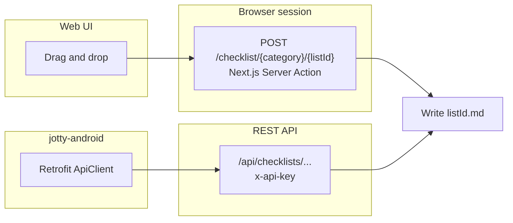

# Checklist item reordering (Android)

## Status

**Not supported in the Android app.** Reordering checklist items is only available in the [Jotty web app](https://jotty.page/) (drag and drop). Track [#29](https://github.com/Darknetzz/jotty-android/issues/29).

Order changed in the web app **does** sync to Android on the next pull (`GET /api/checklists`). This doc explains what the web does and what would unblock in-app reorder.

## Decision (2026-05)

| Approach | Choice |
|----------|--------|
| Emulate web Next.js server action POST from Android | **No** — browser session, RSC/`Next-Action` encoding, brittle per release |
| Document web behaviour + propose upstream REST | **Yes** — this file + [upstream/CHECKLIST_REORDER_API_PROPOSAL.md](upstream/CHECKLIST_REORDER_API_PROPOSAL.md) |
| Android UI/API before Jotty ships reorder REST | **Deferred** |
| Fake reorder via DELETE + ADD on existing REST | **No** — loses item ids, breaks nested/task metadata |

## Why the REST API does not cover reorder today

The Jotty **REST API** (`/api/checklists/...`, `x-api-key`) supports creating items, checking/unchecking, updating text, and deleting by **index path** (`"0"`, `"0.1"`). It does **not** document a reorder endpoint ([public/api/paths/checklists.yaml](https://github.com/fccview/jotty/blob/main/public/api/paths/checklists.yaml) in [fccview/jotty](https://github.com/fccview/jotty)).

The web UI reorders via an internal Next.js server action ([`reorderItems`](https://github.com/fccview/jotty/blob/main/app/_server/actions/checklist-item/reorder.ts)), which writes the checklist markdown file directly. That path is **not** exposed to third-party clients.

## What the web sends (DevTools)

Example: reorder on `POST https://{host}/checklist/Uncategorized/test2` with a body like:

| DevTools field | Server action `FormData` key | Example |
|----------------|------------------------------|---------|
| `_1_listId` | `listId` | `test2` |
| `_1_activeItemId` | `activeItemId` | `test2-1778329054869` |
| `_1_overItemId` | `overItemId` | `test2-1779857748457` |
| `_1_position` | `position` | `before` or `after` |
| `_1_isDropInto` | `isDropInto` | `false` (nest under target when `true`) |
| `_1_category` | `category` | `Uncategorized` |
| `0` | (RSC flight) | e.g. `["$K1"]` — internal to Next.js, not for clients |

- **URL:** page route `/checklist/{category}/{listId}`, **not** `/api/checklists/...`.
- **Auth:** logged-in **session** (cookies), not `x-api-key`.
- **Coordinates:** reorder uses stable **item ids**; other REST mutations use **index paths**. `GET /api/checklists` already returns `id` on each item, so a future Android reorder should be id-driven end-to-end.

Semantics match [`reorder.ts`](https://github.com/fccview/jotty/blob/main/app/_server/actions/checklist-item/reorder.ts): clone tree, move `activeItemId` relative to `overItemId` (`before` / `after` / drop-into), save markdown, broadcast update.

## What would unblock Android support

1. **fccview/jotty** — Add documented REST reorder (proposal: [upstream/CHECKLIST_REORDER_API_PROPOSAL.md](upstream/CHECKLIST_REORDER_API_PROPOSAL.md)), e.g. `POST /api/checklists/{listId}/items/reorder` with the same body fields, `withApiAuth`.
2. **jotty-android** — Retrofit method, offline `MOVE` pending op if needed, drag-and-drop UI (simple lists first, then nested projects).

Until then, use the web app to reorder; the Android app shows a short hint on checklist detail ([#29](https://github.com/Darknetzz/jotty-android/issues/29)).

## References

- Android issue: [#29](https://github.com/Darknetzz/jotty-android/issues/29)
- Upstream API proposal: [upstream/CHECKLIST_REORDER_API_PROPOSAL.md](upstream/CHECKLIST_REORDER_API_PROPOSAL.md)
- Jotty server action: [`app/_server/actions/checklist-item/reorder.ts`](https://github.com/fccview/jotty/blob/main/app/_server/actions/checklist-item/reorder.ts)
